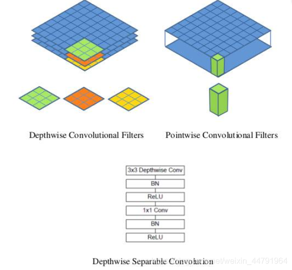
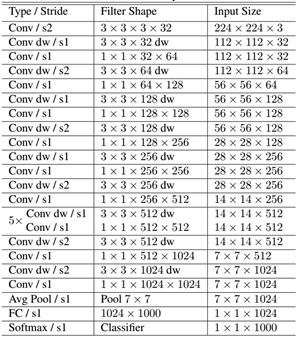
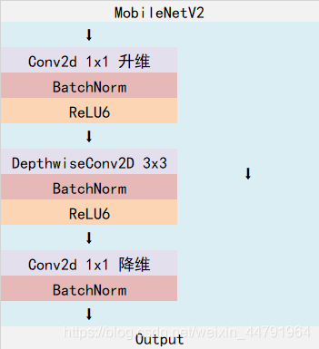
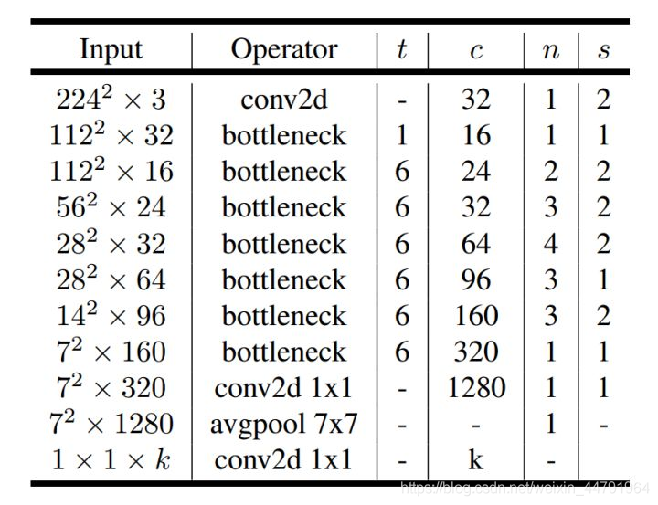
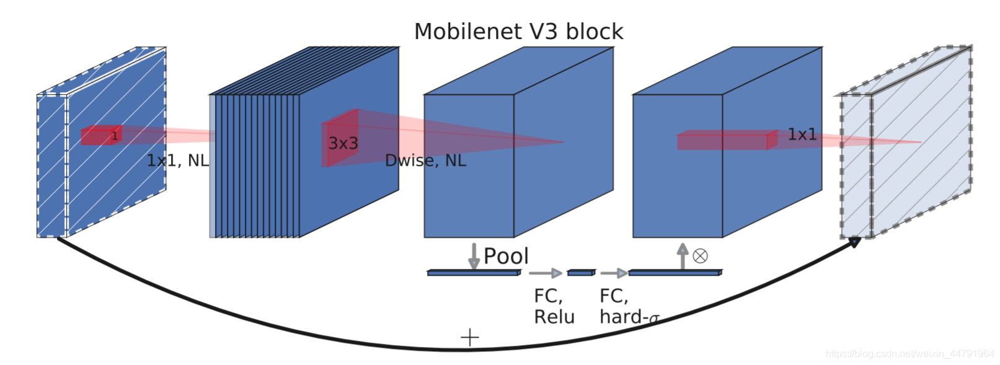
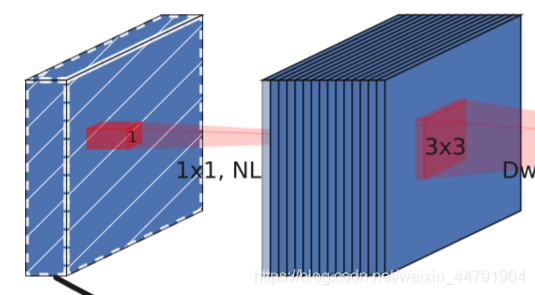
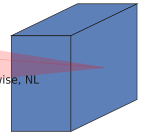
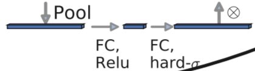
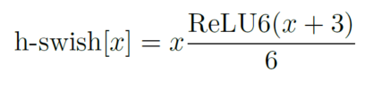
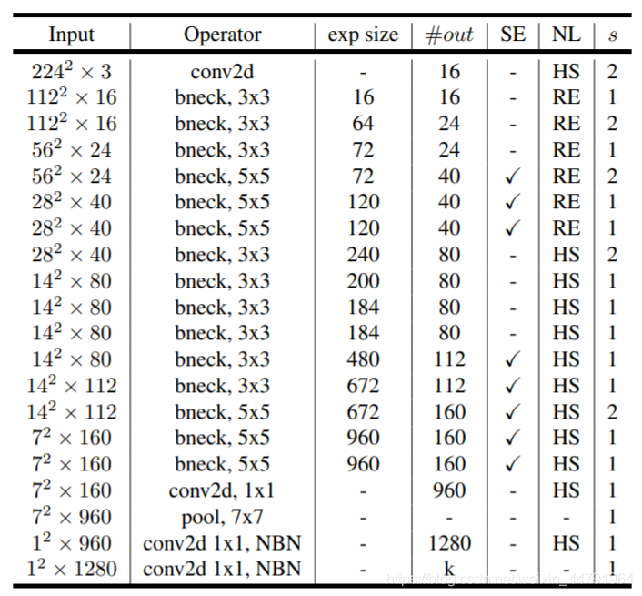

# 源码下载

https://github.com/bubbliiiing/mobilenet-yolov4-pytorch


# 网络替换实现思路

## 1、网络结构解析与替换思路解析


对于YoloV4而言，其整个网络结构可以分为三个部分。

分别是：

1. 主干特征提取网络Backbone，对应图像上的CSPdarknet53
2. 加强特征提取网络，对应图像上的SPP和PANet
3. 预测网络YoloHead，利用获得到的特征进行预测

其中：

第一部分**主干特征提取网络**的功能是进行**初步的特征提取**，利用主干特征提取网络，我们可以获得三个**初步的有效特征层**。

第二部分**加强特征提取网络**的功能是进行**加强的特征提取**，利用加强特征提取网络，我们可以对三个**初步的有效特征层**进行特征融合，提取出更好的特征，获得三个**更有效的有效特征层**。

第三部分**预测网络**的功能是利用更有效的有效特整层获得预测结果。

在这三部分中，第1部分和第2部分可以更容易去修改。第3部分可修改内容不大，毕竟本身也只是3x3卷积和1x1卷积的组合。

mobilenet系列网络可用于进行分类，其主干部分的作用是进行特征提取，我们可以使用mobilenet系列网络代替yolov4当中的CSPdarknet53进行特征提取，将三个初步的有效特征层相同shape的特征层进行加强特征提取，便可以将mobilenet系列替换进yolov4当中了。

## 2、mobilenet系列网络介绍

本文共用到三个主干特征提取网络，分别是mobilenetV1、mobilenetV2、mobilenetV3。

### a、mobilenetV1介绍 DW卷积

MobileNet模型是Google针对手机等嵌入式设备提出的一种轻量级的深层神经网络，其使用的核心思想便是depthwise separable convolution（深度可分离卷积块）。

对于一个卷积点而言：

**假设有一个3×3大小的卷积层，其输入通道为16、输出通道为32。具体为，32个3×3大小的卷积核会遍历16个通道中的每个数据，最后可得到所需的32个输出通道，所需参数为16×32×3×3=4608个。**

**应用深度可分离卷积结构块，用16个3×3大小的卷积核分别遍历16通道的数据，得到了16个特征图谱。在融合操作之前，接着用32个1×1大小的卷积核遍历这16个特征图谱，所需参数为16×3×3+16×32×1×1=656个。**

可以看出来depthwise separable convolution可以减少模型的参数。

如下这张图就是depthwise separable convolution的结构



**在建立模型的时候，可以将卷积group设置成in_filters层实现深度可分离卷积，然后再利用1x1卷积调整channels数。**

通俗地理解就是3x3的卷积核厚度只有一层，然后在输入张量上一层一层地滑动，每一次卷积完生成一个输出通道，当卷积完成后，在利用1x1的卷积调整厚度。

**如下就是MobileNet的结构，其中Conv dw就是分层卷积，在其之后都会接一个1x1的卷积进行通道处理，**



上图所示是的mobilenetV1-1的结构，由于我没有办法找到pytorch的mobilenetv1的权重资源，我只有mobilenetV1-0.25的权重，所以本文所使用的mobilenetV1版本就是mobilenetV1-0.25。

mobilenetV1-0.25是mobilenetV1-1通道数压缩为原来1/4的网络。
对于yolov4来讲，我们需要取出它的最后三个shape的有效特征层进行加强特征提取。

在代码中，我们取出了out1、out2、out3。

> nets/mobilenet_v1.py

```python
#---------------------------------------------------#
#   MobileNet-V1: 深度可分离卷积
#---------------------------------------------------#

import time

import torch
import torch.nn as nn
import torch.nn.functional as F

#---------------------------------------------------#
#   Conv+BN+ReLU6
#---------------------------------------------------#
def conv_bn(inp, oup, stride = 1):
    return nn.Sequential(
        nn.Conv2d(inp, oup, 3, stride, 1, bias=False),
        nn.BatchNorm2d(oup),
        nn.ReLU6(inplace=True)
    )

#---------------------------------------------------#
#   dw+pw
#   3x3DWConv + 1x1Conv
#---------------------------------------------------#
def conv_dw(inp, oup, stride = 1):
    return nn.Sequential(
        # 3x3Conv
        # in = put = groups
        nn.Conv2d(inp, inp, 3, stride, 1, groups=inp, bias=False),
        nn.BatchNorm2d(inp),
        nn.ReLU6(inplace=True),

        # 1x1Conv
        nn.Conv2d(inp, oup, 1, 1, 0, bias=False),
        nn.BatchNorm2d(oup),
        nn.ReLU6(inplace=True),
    )

class MobileNetV1(nn.Module):
    def __init__(self):
        super().__init__()
        self.stage1 = nn.Sequential(
            # 416,416,3 -> 208,208,32
            conv_bn(3, 32, 2),
            # 208,208,32 -> 208,208,64
            conv_dw(32, 64, 1),

            # 208,208,64 -> 104,104,128
            conv_dw(64, 128, 2),
            conv_dw(128, 128, 1),

            # 104,104,128 -> 52,52,256
            conv_dw(128, 256, 2),
            conv_dw(256, 256, 1),
        )
        # 52,52,256 -> 26,26,512
        self.stage2 = nn.Sequential(
            conv_dw(256, 512, 2),
            conv_dw(512, 512, 1),
            conv_dw(512, 512, 1),
            conv_dw(512, 512, 1),
            conv_dw(512, 512, 1),
            conv_dw(512, 512, 1),
        )
        # 26,26,512 -> 13,13,1024
        self.stage3 = nn.Sequential(
            conv_dw(512, 1024, 2),
            conv_dw(1024, 1024, 1),
        )
        self.avg = nn.AdaptiveAvgPool2d((1,1))
        self.fc = nn.Linear(1024, 1000)

    def forward(self, x):
        x = self.stage1(x)  # 416,416,3 -> 52,52, 256
        x = self.stage2(x)  # 52,52,256 -> 26,26, 512
        x = self.stage3(x)  # 26,26,512 -> 13,13,1024
        x = self.avg(x)
        # x = self.model(x)
        x = x.view(-1, 1024)
        x = self.fc(x)
        return x

def mobilenet_v1(pretrained=False, progress=True):
    model = MobileNetV1()
    if pretrained:
        state_dict = torch.load('./model_data/mobilenet_v1_weights.pth')
        model.load_state_dict(state_dict, strict=True)
    return model

if __name__ == "__main__":
    import torch
    from torchsummary import summary

    # 需要使用device来指定网络在GPU还是CPU运行
    device = torch.device('cuda' if torch.cuda.is_available() else 'cpu')
    model = mobilenet_v1().to(device)
    summary(model, input_size=(3, 416, 416))
```

### b、mobilenetV2介绍 倒残差+DW卷积

MobileNetV2是MobileNet的升级版，它具有一个非常重要的特点就是使用了Inverted resblock，整个mobilenetv2都由Inverted resblock组成。

Inverted resblock可以分为两个部分：
左边是主干部分，首先利用1x1卷积进行升维，然后利用3x3深度可分离卷积进行特征提取，然后再利用1x1卷积降维。
右边是残差边部分，输入和输出直接相接。
在这里插入图片描述



整体网络结构如下：（其中Inverted resblock进行的操作就是上述结构）



对于yolov4来讲，我们需要取出它的最后三个shape的有效特征层进行加强特征提取。

在代码中，我们取出了out1、out2、out3。

> nets/mobilenet_v2.py

```python
#---------------------------------------------------#
#   MobileNet-V2: 倒残差结构
#   1x1 3x3DWConv 1x1
#---------------------------------------------------#

from torch import nn
from torch.hub import load_state_dict_from_url

model_urls = {
    'mobilenet_v2': 'https://download.pytorch.org/models/mobilenet_v2-b0353104.pth',
}


def _make_divisible(v, divisor, min_value=None):
    if min_value is None:
        min_value = divisor
    new_v = max(min_value, int(v + divisor / 2) // divisor * divisor)
    if new_v < 0.9 * v:
        new_v += divisor
    return new_v

class ConvBNReLU(nn.Sequential):
    def __init__(self, in_planes, out_planes, kernel_size=3, stride=1, groups=1):
        padding = (kernel_size - 1) // 2
        super(ConvBNReLU, self).__init__(
            nn.Conv2d(in_planes, out_planes, kernel_size, stride, padding, groups=groups, bias=False),
            nn.BatchNorm2d(out_planes),
            nn.ReLU6(inplace=True)
        )

#---------------------------------------------------#
#   倒残差结构
#   残差:   两端channel多,中间channel少
#       降维 --> 升维
#   倒残差: 两端channel少,中间channel多
#       升维 --> 降维
#   1x1 3x3DWConv 1x1
#   最后的1x1Conv没有激活函数
#---------------------------------------------------#
class InvertedResidual(nn.Module):
    def __init__(self, inp, oup, stride, expand_ratio):
        super(InvertedResidual, self).__init__()
        self.stride = stride
        assert stride in [1, 2]

        hidden_dim = int(round(inp * expand_ratio))

        # 步长为1同时通道不变化才相加
        self.use_res_connect = self.stride == 1 and inp == oup

        layers = []
        #----------------------------------------------------#
        #   利用1x1卷积根据输入进来的通道数进行通道数上升,不扩张就不需要第一个1x1卷积了
        #----------------------------------------------------#
        if expand_ratio != 1:
            layers.append(ConvBNReLU(inp, hidden_dim, kernel_size=1))

        layers.extend([
            #--------------------------------------------#
            #   进行3x3的DW+PW卷积
            #--------------------------------------------#
            ConvBNReLU(hidden_dim, hidden_dim, stride=stride, groups=hidden_dim),
            #-----------------------------------#
            #   利用1x1卷积进行通道数的调整,没有激活函数
            #-----------------------------------#
            nn.Conv2d(hidden_dim, oup, 1, 1, 0, bias=False),
            nn.BatchNorm2d(oup),
        ])
        self.conv = nn.Sequential(*layers)

    def forward(self, x):
        if self.use_res_connect:
            return x + self.conv(x)
        else:
            return self.conv(x)


class MobileNetV2(nn.Module):
    def __init__(self, num_classes=1000, width_mult=1.0, inverted_residual_setting=None, round_nearest=8):
        super().__init__()
        block = InvertedResidual
        input_channel = 32
        last_channel = 1280

        if inverted_residual_setting is None:
            inverted_residual_setting = [
                # t 扩展因子,第一层卷积让channel维度变多
                # c out_channel 或 k1
                # n bottlenet 重复次数
                # s 步长(每一个block的第一层步长)
                # t, c, n, s
                # 208,208,32 -> 208,208,16
                [1, 16, 1, 1],
                # 208,208,16 -> 104,104,24
                [6, 24, 2, 2],
                # 104,104,24 -> 52,52,32    out3
                [6, 32, 3, 2],

                # 52,52,32 -> 26,26,64
                [6, 64, 4, 2],
                # 26,26,64 -> 26,26,96      out4
                [6, 96, 3, 1],

                # 26,26,96 -> 13,13,160
                [6, 160, 3, 2],
                # 13,13,160 -> 13,13,320    out5
                [6, 320, 1, 1],
            ]

        if len(inverted_residual_setting) == 0 or len(inverted_residual_setting[0]) != 4:
            raise ValueError("inverted_residual_setting should be non-empty "
                             "or a 4-element list, got {}".format(inverted_residual_setting))

        input_channel = _make_divisible(input_channel * width_mult, round_nearest)
        self.last_channel = _make_divisible(last_channel * max(1.0, width_mult), round_nearest)

        #-----------------------------------#
        #   第一层卷积
        #   416,416,3 -> 208,208,32
        #-----------------------------------#
        features = [ConvBNReLU(3, input_channel, stride=2)]

        #-----------------------------------#
        #   重复添加n次DW卷积
        #-----------------------------------#
        for t, c, n, s in inverted_residual_setting:
            output_channel = _make_divisible(c * width_mult, round_nearest)
            # 重复添加n次DW卷积
            for i in range(n):
                stride = s if i == 0 else 1
                features.append(block(input_channel, output_channel, stride, expand_ratio=t))
                input_channel = output_channel

        #-----------------------------------#
        #   最后一层卷积
        #   13,13,320 -> 13,13,1280
        #-----------------------------------#
        features.append(ConvBNReLU(input_channel, self.last_channel, kernel_size=1))
        self.features = nn.Sequential(*features)

        self.classifier = nn.Sequential(
            nn.Dropout(0.2),
            nn.Linear(self.last_channel, num_classes),
        )

        for m in self.modules():
            if isinstance(m, nn.Conv2d):
                nn.init.kaiming_normal_(m.weight, mode='fan_out')
                if m.bias is not None:
                    nn.init.zeros_(m.bias)
            elif isinstance(m, nn.BatchNorm2d):
                nn.init.ones_(m.weight)
                nn.init.zeros_(m.bias)
            elif isinstance(m, nn.Linear):
                nn.init.normal_(m.weight, 0, 0.01)
                nn.init.zeros_(m.bias)

    def forward(self, x):
        x = self.features(x)
        x = x.mean([2, 3])
        x = self.classifier(x)
        return x

def mobilenet_v2(pretrained=False, progress=True):
    model = MobileNetV2()
    if pretrained:
        state_dict = load_state_dict_from_url(model_urls['mobilenet_v2'], model_dir="model_data",
                                              progress=progress)
        model.load_state_dict(state_dict)

    return model

if __name__ == "__main__":
    print(mobilenet_v2())
```

### c、mobilenetV3介绍 倒残差+DW卷积+SE

mobilenetV3使用了特殊的bneck结构。

**bneck结构如下图所示：**



它综合了以下四个特点：
 a、**MobileNetV2的具有线性瓶颈的逆残差结构(the inverted residual with linear bottleneck)。**



即先利用1x1卷积进行升维度，再进行下面的操作，并具有残差边。

b、**MobileNetV1的深度可分离卷积（depthwise separable convolutions）。**



在输入1x1卷积进行升维度后，进行3x3深度可分离卷积。

**c、轻量级的注意力模型。**



**d、利用h-swish代替swish函数。**

在结构中使用了h-swish激活函数，代替swish函数，减少运算量，提高性能。



下图为整个mobilenetV3的结构图：



如何看懂这个表呢？我们从每一列出发：

**第一列Input代表mobilenetV3每个特征层的shape变化；**

**第二列Operator代表每次特征层即将经历的block结构，我们可以看到在MobileNetV3中，特征提取经过了许多的bneck结构；**

**第三、四列分别代表了bneck内逆残差结构上升后的通道数、输入到bneck时特征层的通道数。**

**第五列SE代表了是否在这一层引入注意力机制。**

**第六列NL代表了激活函数的种类，HS代表h-swish，RE代表RELU。**

**第七列s代表了每一次block结构所用的步长。**

对于yolov4来讲，我们需要取出它的最后三个shape的有效特征层进行加强特征提取。

在代码中，我们取出了out1、out2、out3。

> nets/mobilenet_v3.py

```python
#---------------------------------------------------#
#   MobileNet-V3: 倒残差结构
#   1x1 3x3DWConv SE 1x1
#---------------------------------------------------#

import math

import torch
import torch.nn as nn


def _make_divisible(v, divisor, min_value=None):
    if min_value is None:
        min_value = divisor
    new_v = max(min_value, int(v + divisor / 2) // divisor * divisor)
    # Make sure that round down does not go down by more than 10%.
    if new_v < 0.9 * v:
        new_v += divisor
    return new_v

#---------------------------------------------------#
#   nn.Hardsigmoid
#---------------------------------------------------#
class h_sigmoid(nn.Module):
    def __init__(self, inplace=True):
        super(h_sigmoid, self).__init__()
        self.relu = nn.ReLU6(inplace=inplace)

    def forward(self, x):
        return self.relu(x + 3) / 6

#---------------------------------------------------#
#   nn.Hardswish()
#---------------------------------------------------#
class h_swish(nn.Module):
    def __init__(self, inplace=True):
        super().__init__()
        self.sigmoid = h_sigmoid(inplace=inplace)

    def forward(self, x):
        return x * self.sigmoid(x)

#---------------------------------------------------#
#   注意力机制
#---------------------------------------------------#
class SELayer(nn.Module):
    def __init__(self, channel, reduction=4):
        super().__init__()
        self.avg_pool = nn.AdaptiveAvgPool2d(1)
        self.fc = nn.Sequential(
                nn.Linear(channel, _make_divisible(channel // reduction, 8)),
                nn.ReLU(inplace=True),
                nn.Linear(_make_divisible(channel // reduction, 8), channel),
                h_sigmoid()
        )

    def forward(self, x):
        b, c, _, _ = x.size()
        y = self.avg_pool(x).view(b, c)
        y = self.fc(y).view(b, c, 1, 1)
        return x * y

def conv_3x3_bn(inp, oup, stride):
    return nn.Sequential(
        nn.Conv2d(inp, oup, 3, stride, 1, bias=False),
        nn.BatchNorm2d(oup),
        h_swish()
    )

def conv_1x1_bn(inp, oup):
    return nn.Sequential(
        nn.Conv2d(inp, oup, 1, 1, 0, bias=False),
        nn.BatchNorm2d(oup),
        h_swish()
    )

#---------------------------------------------------#
#   倒残差结构
#   残差:   两端channel多,中间channel少
#       降维 --> 升维
#   倒残差: 两端channel少,中间channel多
#       升维 --> 降维
#   1x1 3x3DWConv SE 1x1
#   最后的1x1Conv没有激活函数
#---------------------------------------------------#
class InvertedResidual(nn.Module):
    def __init__(self, inp, hidden_dim, oup, kernel_size, stride, use_se, use_hs):
        super().__init__()
        assert stride in [1, 2]

        # 步长为1同时通道不变化才相加
        self.identity = stride == 1 and inp == oup

        #---------------------------------------------------#
        #   输入和输出通道相等就不要第一个1x1Conv
        #---------------------------------------------------#
        if inp == hidden_dim:
            self.conv = nn.Sequential(
                # dw
                nn.Conv2d(hidden_dim, hidden_dim, kernel_size, stride, (kernel_size - 1) // 2, groups=hidden_dim, bias=False),
                nn.BatchNorm2d(hidden_dim),
                h_swish() if use_hs else nn.ReLU(inplace=True),

                # Squeeze-and-Excite
                SELayer(hidden_dim) if use_se else nn.Identity(),

                # pw-linear 没有激活函数
                nn.Conv2d(hidden_dim, oup, 1, 1, 0, bias=False),
                nn.BatchNorm2d(oup),
            )
        else:
            self.conv = nn.Sequential(
                # pw
                nn.Conv2d(inp, hidden_dim, 1, 1, 0, bias=False),
                nn.BatchNorm2d(hidden_dim),
                h_swish() if use_hs else nn.ReLU(inplace=True),

                # dw
                nn.Conv2d(hidden_dim, hidden_dim, kernel_size, stride, (kernel_size - 1) // 2, groups=hidden_dim, bias=False),
                nn.BatchNorm2d(hidden_dim),

                # Squeeze-and-Excite
                SELayer(hidden_dim) if use_se else nn.Identity(),
                h_swish() if use_hs else nn.ReLU(inplace=True),

                # pw-linear 没有激活函数
                nn.Conv2d(hidden_dim, oup, 1, 1, 0, bias=False),
                nn.BatchNorm2d(oup),
            )

    def forward(self, x):
        if self.identity:
            return x + self.conv(x)
        else:
            return self.conv(x)


class MobileNetV3(nn.Module):
    def __init__(self, num_classes=1000, width_mult=1.):
        super().__init__()
        # setting of inverted residual blocks
        self.cfgs = [
            #    k, 扩展倍率,c, SE,HS,s
                # 208,208,16 -> 208,208,16
                [3,   1,  16, 0, 0, 1],

                # 208,208,16 -> 104,104,24
                [3,   4,  24, 0, 0, 2],
                [3,   3,  24, 0, 0, 1],

                # 104,104,24 -> 52,52,40
                [5,   3,  40, 1, 0, 2],
                [5,   3,  40, 1, 0, 1],
                [5,   3,  40, 1, 0, 1],     # out3 index:6

                # 52,52,40 -> 26,26,80
                [3,   6,  80, 0, 1, 2],
                [3, 2.5,  80, 0, 1, 1],
                [3, 2.3,  80, 0, 1, 1],
                [3, 2.3,  80, 0, 1, 1],

                # 26,26,80 -> 26,26,112
                [3,   6, 112, 1, 1, 1],
                [3,   6, 112, 1, 1, 1],     # out4 index:12

                # 26,26,112 -> 13,13,160
                [5,   6, 160, 1, 1, 2],
                [5,   6, 160, 1, 1, 1],
                [5,   6, 160, 1, 1, 1]      # out5 index:15
        ]

        #-----------------------------------#
        #   第一层卷积  V2中是32,这里改为了16
        #   416,416,3 -> 208,208,16
        #-----------------------------------#
        input_channel = _make_divisible(16 * width_mult, 8)
        layers = [conv_3x3_bn(3, input_channel, 2)]

        #-----------------------------------#
        #   重复添加15次DW卷积
        #   208,208,16 -> 13,13,160
        #-----------------------------------#
        block = InvertedResidual
        for k, t, c, use_se, use_hs, s in self.cfgs:
            output_channel = _make_divisible(c * width_mult, 8)
            exp_size = _make_divisible(input_channel * t, 8)
            layers.append(block(input_channel, exp_size, output_channel, k, s, use_se, use_hs))
            input_channel = output_channel
        self.features = nn.Sequential(*layers)

        #-----------------------------------#
        #   最后一层卷积
        #   7,7,160 -> 7,7,960
        #-----------------------------------#
        self.conv = conv_1x1_bn(input_channel, exp_size)

        self.avgpool = nn.AdaptiveAvgPool2d((1, 1))
        output_channel = _make_divisible(1280 * width_mult, 8) if width_mult > 1.0 else 1280
        # b,960 -> b,1280 -> b,num_classes
        self.classifier = nn.Sequential(
            nn.Linear(exp_size, output_channel),
            h_swish(),
            nn.Dropout(0.2),
            nn.Linear(output_channel, num_classes),
        )

        self._initialize_weights()

    def forward(self, x):
        x = self.features(x)
        x = self.conv(x)
        x = self.avgpool(x)
        x = x.view(x.size(0), -1)
        x = self.classifier(x)
        return x

    def _initialize_weights(self):
        for m in self.modules():
            if isinstance(m, nn.Conv2d):
                n = m.kernel_size[0] * m.kernel_size[1] * m.out_channels
                m.weight.data.normal_(0, math.sqrt(2. / n))
                if m.bias is not None:
                    m.bias.data.zero_()
            elif isinstance(m, nn.BatchNorm2d):
                m.weight.data.fill_(1)
                m.bias.data.zero_()
            elif isinstance(m, nn.Linear):
                n = m.weight.size(1)
                m.weight.data.normal_(0, 0.01)
                m.bias.data.zero_()

def mobilenet_v3(pretrained=False, **kwargs):
    model = MobileNetV3(**kwargs)
    if pretrained:
        state_dict = torch.load('./model_data/mobilenetv3-large-1cd25616.pth')
        model.load_state_dict(state_dict, strict=True)
    return model
```

## 3、将预测结果融入到yolov4网络当中 5次卷积的3x3变为DW卷积


对于yolov4来讲，我们需要利用主干特征提取网络获得的**三个有效特征进行加强特征金字塔的构建**。

**利用上一步定义的MobilenetV1、MobilenetV2、MobilenetV3三个函数我们可以获得每个Mobilenet网络对应的三个有效特征层。**

我们可以利用这三个有效特征层替换原来yolov4主干网络CSPdarknet53的有效特征层。

**为了进一步减少参数量，我们可以使用深度可分离卷积代替yoloV3中用到的普通卷积。**

> nets/yolo.py

```python
from collections import OrderedDict

import torch
import torch.nn as nn
import torch.nn.functional as F

from nets.densenet import _Transition, densenet121, densenet169, densenet201
from nets.ghostnet import ghostnet
from nets.mobilenet_v1 import mobilenet_v1
from nets.mobilenet_v2 import mobilenet_v2
from nets.mobilenet_v3 import mobilenet_v3

#---------------------------------------------------#
#   MobileNet-V1: 深度可分离卷积
#---------------------------------------------------#
class MobileNetV1(nn.Module):
    def __init__(self, pretrained = False):
        super().__init__()
        self.model = mobilenet_v1(pretrained=pretrained)

    def forward(self, x):
        out3 = self.model.stage1(x)     # 416,416,3 -> 52,52,256
        out4 = self.model.stage2(out3)  # 52,52,256 -> 26,26,512
        out5 = self.model.stage3(out4)  # 26,26,512 -> 13,13,1024
        return out3, out4, out5

#---------------------------------------------------#
#   MobileNet-V2: 倒残差结构
#   1x1 3x3DWConv 1x1
#---------------------------------------------------#
class MobileNetV2(nn.Module):
    def __init__(self, pretrained = False):
        super().__init__()
        self.model = mobilenet_v2(pretrained=pretrained)

    def forward(self, x):
        out3 = self.model.features[:7](x)       # 416,416,3 -> 52,52,32
        out4 = self.model.features[7:14](out3)  #  52,52,32 -> 26,26,96
        out5 = self.model.features[14:18](out4) #  26,26,96 -> 13,13,320
        return out3, out4, out5

#---------------------------------------------------#
#   MobileNet-V3: 倒残差结构
#   1x1 3x3DWConv SE 1x1
#---------------------------------------------------#
class MobileNetV3(nn.Module):
    def __init__(self, pretrained = False):
        super().__init__()
        self.model = mobilenet_v3(pretrained=pretrained)

    def forward(self, x):
        out3 = self.model.features[:7](x)       # 416,416,3 -> 52,52,40
        out4 = self.model.features[7:13](out3)  # 52,52,40  -> 26,26,112
        out5 = self.model.features[13:16](out4) # 26,26,112 -> 13,13,160
        return out3, out4, out5

class GhostNet(nn.Module):
    def __init__(self, pretrained=True):
        super().__init__()
        model = ghostnet()
        if pretrained:
            state_dict = torch.load("model_data/ghostnet_weights.pth")
            model.load_state_dict(state_dict)
        del model.global_pool
        del model.conv_head
        del model.act2
        del model.classifier
        del model.blocks[9]
        self.model = model

    def forward(self, x):
        x = self.model.conv_stem(x)
        x = self.model.bn1(x)
        x = self.model.act1(x)
        feature_maps = []

        for idx, block in enumerate(self.model.blocks):
            x = block(x)
            if idx in [2,4,6,8]:
                feature_maps.append(x)
        return feature_maps[1:]

class Densenet(nn.Module):
    def __init__(self, backbone, pretrained=False):
        super().__init__()
        densenet = {
            "densenet121" : densenet121,
            "densenet169" : densenet169,
            "densenet201" : densenet201
        }[backbone]
        model = densenet(pretrained)
        del model.classifier
        self.model = model

    def forward(self, x):
        feature_maps = []
        for block in self.model.features:
            if type(block)==_Transition:
                for _, subblock in enumerate(block):
                    x = subblock(x)
                    if type(subblock)==nn.Conv2d:
                        feature_maps.append(x)
            else:
                x = block(x)
        x = F.relu(x, inplace=True)
        feature_maps.append(x)
        return feature_maps[1:]

#-------------------------------------------------#
#   卷积块
#   Conv2d + BatchNorm2d + LeakyReLU
#-------------------------------------------------#
def conv2d(filter_in, filter_out, kernel_size, groups=1, stride=1):
    pad = (kernel_size - 1) // 2 if kernel_size else 0
    return nn.Sequential(OrderedDict([
        ("conv", nn.Conv2d(filter_in, filter_out, kernel_size=kernel_size, stride=stride, padding=pad, groups=groups, bias=False)),
        ("bn", nn.BatchNorm2d(filter_out)),
        ("relu", nn.ReLU6(inplace=True)),
    ]))

#---------------------------------------------------#
#   dw+pw
#   3x3DWConv + 1x1Conv
#---------------------------------------------------#
def conv_dw(filter_in, filter_out, stride = 1):
    return nn.Sequential(
        # 3x3Conv
        # in = put = groups
        nn.Conv2d(filter_in, filter_in, 3, stride, 1, groups=filter_in, bias=False),
        nn.BatchNorm2d(filter_in),
        nn.ReLU6(inplace=True),

        # 1x1Conv
        nn.Conv2d(filter_in, filter_out, 1, 1, 0, bias=False),
        nn.BatchNorm2d(filter_out),
        nn.ReLU6(inplace=True),
    )

#---------------------------------------------------#
#   SPP结构，利用不同大小的池化核进行池化,增大感受野
#   池化后和输入数据进行维度堆叠
#   pool_sizes=[1, 5, 9, 13] 1不变,所以不用做了
#---------------------------------------------------#
class SpatialPyramidPooling(nn.Module):
    def __init__(self, pool_sizes=[5, 9, 13]):
        super().__init__()

        self.maxpools = nn.ModuleList([nn.MaxPool2d(pool_size, 1, pool_size//2) for pool_size in pool_sizes])

    def forward(self, x):
        features = [maxpool(x) for maxpool in self.maxpools[::-1]]
        features = torch.cat(features + [x], dim=1)

        return features

#---------------------------------------------------#
#   卷积 + 上采样
#---------------------------------------------------#
class Upsample(nn.Module):
    def __init__(self, in_channels, out_channels):
        super().__init__()

        self.upsample = nn.Sequential(
            conv2d(in_channels, out_channels, 1),
            nn.Upsample(scale_factor=2, mode='nearest')
        )

    def forward(self, x,):
        x = self.upsample(x)
        return x

#---------------------------------------------------#
#   三次卷积块 SPP前后的模块
#---------------------------------------------------#
def make_three_conv(filters_list, in_filters):
    m = nn.Sequential(
        conv2d( in_filters,      filters_list[0], 1),    # 1 降低通道
        conv_dw(filters_list[0], filters_list[1]),       # 3 DWConv提取特征
        conv2d( filters_list[1], filters_list[0], 1),
    )
    return m

#---------------------------------------------------#
#   五次卷积块 PANet中使用
#   3x3Conv -> 3x3DWConv
#---------------------------------------------------#
def make_five_conv(filters_list, in_filters):
    m = nn.Sequential(
        conv2d( in_filters,      filters_list[0], 1),    # 1 降低通道
        conv_dw(filters_list[0], filters_list[1]),       # 3 DWConv提取特征
        conv2d( filters_list[1], filters_list[0], 1),
        conv_dw(filters_list[0], filters_list[1]),
        conv2d( filters_list[1], filters_list[0], 1),
    )
    return m

#---------------------------------------------------#
#   最后获得yolov4的输出
#   3x3Conv -> 3x3DWConv
#---------------------------------------------------#
def yolo_head(filters_list, in_filters):
    m = nn.Sequential(
        conv_dw(  in_filters,      filters_list[0]),     # 特征整合
        nn.Conv2d(filters_list[0], filters_list[1], 1),  # 将通道转换为预测
    )
    return m

#---------------------------------------------------#
#   yolo_body
#---------------------------------------------------#
class YoloBody(nn.Module):
    def __init__(self, anchors_mask, num_classes, backbone="mobilenetv2", pretrained=False):
        super(YoloBody, self).__init__()
        #---------------------------------------------------#
        #   生成mobilnet的主干模型，获得三个有效特征层。
        #---------------------------------------------------#
        if backbone == "mobilenetv1":
            #---------------------------------------------------#
            #   52,52,256; 26,26,512; 13,13,1024
            #---------------------------------------------------#
            self.backbone   = MobileNetV1(pretrained=pretrained)
            in_filters      = [256, 512, 1024]
        elif backbone == "mobilenetv2":
            #---------------------------------------------------#
            #   52,52,32; 26,26,96; 13,13,320
            #---------------------------------------------------#
            self.backbone   = MobileNetV2(pretrained=pretrained)
            in_filters      = [32, 96, 320]
        elif backbone == "mobilenetv3":
            #---------------------------------------------------#
            #   52,52,40; 26,26,112; 13,13,160
            #---------------------------------------------------#
            self.backbone   = MobileNetV3(pretrained=pretrained)
            in_filters      = [40, 112, 160]
        elif backbone == "ghostnet":
            #---------------------------------------------------#
            #   52,52,40; 26,26,112; 13,13,160
            #---------------------------------------------------#
            self.backbone   = GhostNet(pretrained=pretrained)
            in_filters      = [40, 112, 160]
        elif backbone in ["densenet121", "densenet169", "densenet201"]:
            #---------------------------------------------------#
            #   52,52,256; 26,26,512; 13,13,1024
            #---------------------------------------------------#
            self.backbone   = Densenet(backbone, pretrained=pretrained)
            in_filters = {
                "densenet121" : [256, 512, 1024],
                "densenet169" : [256, 640, 1664],
                "densenet201" : [256, 896, 1920]
            }[backbone]
        else:
            raise ValueError('Unsupported backbone - `{}`, Use mobilenetv1, mobilenetv2, mobilenetv3, ghostnet, densenet121, densenet169, densenet201.'.format(backbone))

        #---------------------------------------------------#
        #   用mobilenetV3举例
        #---------------------------------------------------#

        #---------------------------------------------------#
        #   SPP部分,不同分支池化
        #---------------------------------------------------#
        self.conv1           = make_three_conv([512, 1024], in_filters[2])  # 13,13, 160 -> 13,13, 512  使用不同模型唯一变化的就是用了in_filters的卷积
        self.SPP             = SpatialPyramidPooling()                      # 13,13, 512 -> 13,13,2048
        self.conv2           = make_three_conv([512, 1024], 2048)           # 13,13,2048 -> 13,13, 512

        #---------------------------------------------------#
        #   上采样部分 2次  p3,p4要先进行1x1卷积降低维度
        #---------------------------------------------------#
        self.upsample1       = Upsample(512, 256)               # 13,13,512 -> 26,26,256    p5的1x1conv+上采样
        self.conv_for_P4     = conv2d(in_filters[1], 256, 1)    # 26,26,112 -> 26,26,256    拼接之前的1x1conv   使用不同模型唯一变化的就是用了in_filters的卷积
        self.make_five_conv1 = make_five_conv([256, 512], 512)  # 26,26,512 -> 26,26,256

        self.upsample2       = Upsample(256, 128)               # 26,26,256 -> 52,52,128    p4的1x1conv+上采样
        self.conv_for_P3     = conv2d(in_filters[0], 128, 1)    # 52,52, 40 -> 52,52,128    拼接之前的1x1conv   使用不同模型唯一变化的就是用了in_filters的卷积
        self.make_five_conv2 = make_five_conv([128, 256], 256)  # 52,52,256 -> 52,52,128

        #---------------------------------------------------#
        #   head部分
        #   下采样部分 2次 重新计算P4 P5    输入数据不需要预先进行1x1卷积
        #   3x3Conv -> 3x3DWConv
        #---------------------------------------------------#
        # 3*(5+num_classes) = 3*(5+20) = 3*(4+1+20)=75
        self.yolo_head3      = yolo_head([256, len(anchors_mask[0]) * (5 + num_classes)], 128)
        self.down_sample1    = conv_dw(128, 256, stride = 2)     # 52,52,128 -> 26,26,256
        self.make_five_conv3 = make_five_conv([256, 512], 512)   # 26,26,512 -> 26,26,256

        # 3*(5+num_classes) = 3*(5+20) = 3*(4+1+20)=75
        self.yolo_head2      = yolo_head([512, len(anchors_mask[1]) * (5 + num_classes)], 256)

        self.down_sample2    = conv_dw(256, 512, stride = 2)     # 26,26,256  -> 13,13,512
        self.make_five_conv4 = make_five_conv([512, 1024], 1024) # 13,13,1024 -> 13,13,512

        # 3*(5+num_classes)=3*(5+20)=3*(4+1+20)=75
        self.yolo_head1      = yolo_head([1024, len(anchors_mask[2]) * (5 + num_classes)], 512)

    def forward(self, x):
        #---------------------------------------------------#
        #   backbone, mobilenetV3举例
        #   52,52,40; 26,26,112; 13,13,160
        #---------------------------------------------------#
        x2, x1, x0 = self.backbone(x)

        #---------------------------------------------------#
        #   SPP部分,不同分支池化
        #---------------------------------------------------#
        P5 = self.conv1(x0)     # 13,13, 160 -> 13,13, 512
        P5 = self.SPP(P5)       # 13,13, 512 -> 13,13,2048
        P5 = self.conv2(P5)     # 13,13,2048 -> 13,13, 512

        #---------------------------------------------------#
        #   上采样部分 2次
        #---------------------------------------------------#
        P5_upsample = self.upsample1(P5)            # 13,13,512 -> 26,26,256
        P4 = self.conv_for_P4(x1)                   # 26,26,112 -> 26,26,256
        P4 = torch.cat([P4,P5_upsample],axis=1)     # 26,26,256 + 26,26,256 -> 26,26,512
        P4 = self.make_five_conv1(P4)               # 26,26,512 -> 26,26,256

        P4_upsample = self.upsample2(P4)            # 26,26,256 -> 52,52,128
        P3 = self.conv_for_P3(x2)                   # 52,52, 40 -> 52,52,128
        P3 = torch.cat([P3,P4_upsample],axis=1)     # 52,52,128 + 52,52,128 -> 52,52,256
        P3 = self.make_five_conv2(P3)               # 52,52,256 -> 52,52,128

        #---------------------------------------------------#
        #   下采样部分 2次 重新计算P4 P5
        #---------------------------------------------------#
        P3_downsample = self.down_sample1(P3)       # 52,52,128 -> 26,26,256
        P4 = torch.cat([P3_downsample,P4],axis=1)   # 26,26,256 + 26,26,256 -> 26,26,512
        P4 = self.make_five_conv3(P4)               # 26,26,512 -> 26,26,256

        P4_downsample = self.down_sample2(P4)       # 26,26,256  -> 13,13,512
        P5 = torch.cat([P4_downsample,P5],axis=1)   # 13,13,512 + 13,13,512 -> 13,13,1024
        P5 = self.make_five_conv4(P5)               # 13,13,1024 -> 13,13,512

        #---------------------------------------------------#
        #   第三个特征层
        #   y3=(b,75,52,52)
        #---------------------------------------------------#
        out2 = self.yolo_head3(P3)
        #---------------------------------------------------#
        #   第二个特征层
        #   y2=(b,75,26,26)
        #---------------------------------------------------#
        out1 = self.yolo_head2(P4)
        #---------------------------------------------------#
        #   第一个特征层
        #   y1=(b,75,13,13)
        #---------------------------------------------------#
        out0 = self.yolo_head1(P5)

        return out0, out1, out2


```

